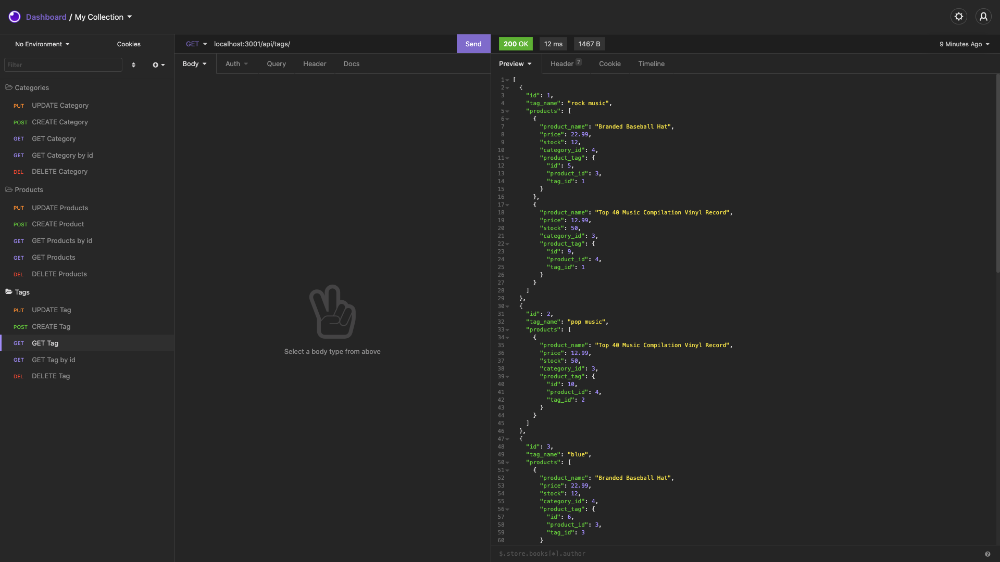

# e-commerce-backend
## Description
This app is the backend portion of an E-Commerce website. Express.js was used for the server and MySQL for the database along with Sequelize as the ORM to run SQL models and queries. The SQL database includes tables for products, categories, tags, and product tags. RESTful API routes are used to make requests and updates from the database which are joined through Sequelize queries.

[Link to screencastify] https://drive.google.com/file/d/1ZuWtyHWgffIxjIdt2V_0Q-X8_QQ2sIB2/view

## Built With

* Node
* Express
* MySQL
* Sequelize
* Dotenv

## Authors

* **Trevor Coons** 

- [Link to Portfolio Site](https://trevcoons.github.io/trevors-portfolio/)
- [Link to Github](https://github.com/trevcoons)
- [Link to LinkedIn](www.linkedin.com/in/trevor-coons-2a948a104)

## Acknowledgments

Thanks to UC Berkeley Coding Bootcamp for teaching me JavaScript and NPM.